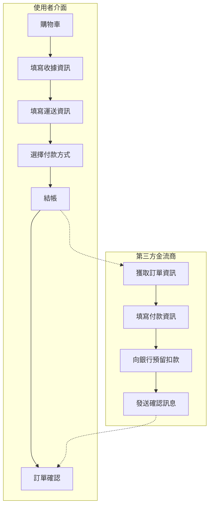

# E-commerce 電商基礎 101

## 商務流程的數位轉型

那麼我們應該如何將商品轉換成一向商務系統呢？

試著問問自己以下幾個問題：

1. 要如何交易商品？
2. 如何確定收受款項？
3. 如何退費？如何計算品項？
4. 如何配合不同國家的稅務、幣值進行運算？
5. 如何管控庫存？
6. 是否需要確認銷售/利潤的計算？

從金流收款、促銷推廣、商品A/B測試、一路到商品庫存等商品的資料，要進行系統化管理，上述的問題會是建置電商時所要考量項目中的冰山一角。雖說初步建立時不需要一次將所有的系統部件完善，但無論您是付額建置服務的廠商或提出需求的客戶，都必須了解這些基礎知識，已確保雙方的訴求/溝通是在同一個平面上，減少無謂的誤會與溝通成本。

<blockquote>
💡 時間，尤其是花在重複/修改功能上，是開發上最大的成本；
花費時間確認需求，不讓需求無限增長(限制)，才能節省最多成本！
</blockquote>

## 實體商品 > 商品數位化

日常生活中買賣看似如此簡單，但轉換成系統後會進行什麼流程呢？要如何讓系統將日常見到的商品數據化，以便統計、自動計算庫存、銷售呢？這一切的源頭都源自「商品」的定義

以下簡易說明：

**上架之前：**
店家需要定義好商品的資訊： 
- 商品 (product)
  - 商品敘述性資訊
  - 商品種類 (product-variation)
    - 商品種類定價 (list price)
    - 商品種類售價 (price)
    - 商品屬性 (attribute)
    - [商品最小存貨單位編碼 (SKU, single stocking unit)](https://wiki.mbalib.com/zh-tw/SKU%E7%AE%A1%E7%90%86)

<blockquote>
👋 SKU 常用以辨別商品的銷量，相同的商品但庫存計算是依照種類、屬性時，那麼每個獨一無二的組合就是一個SKU編碼 例：iPhone 13 粉紅色、午夜色會建立各別的SKU來追蹤庫存存量與售額。
</blockquote>

**購物車流程：**
下方圖示說明常見之電商購物流程，可根據商家自訂邏輯進行變動

<blockquote>
⚠️ 串接金流請審慎確定其符合資安規範，如HTTPS協定、XSS防範等，請參考 <a href="https://owasp.org/www-project-secure-coding-practices-quick-reference-guide/migrated_content" target="_blank">OWASP</a>與金流商提供之串接資訊
</blockquote>

---