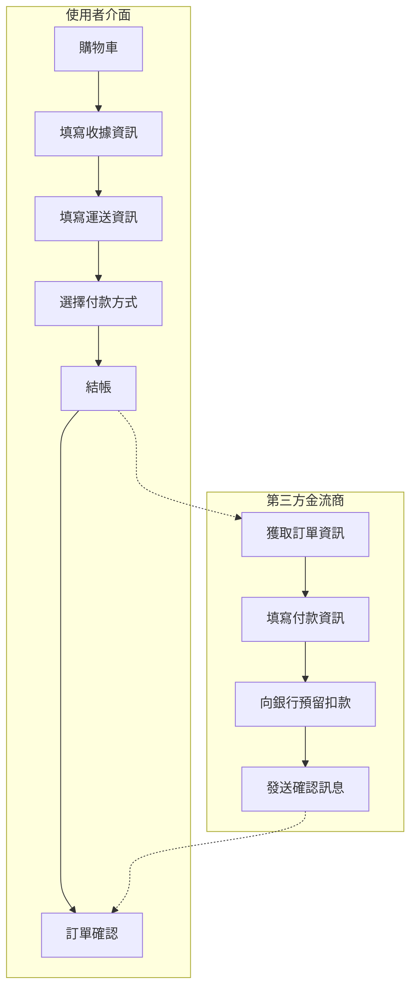

# E-commerce 電商基礎 101

## 商務流程的數位轉型

那麼我們應該如何將商品轉換成一向商務系統呢？

試著問問自己以下幾個問題：

1. 要如何交易商品？
2. 如何確定收受款項？
3. 如何退費？如何計算品項？
4. 如何配合不同國家的稅務、幣值進行運算？
5. 如何管控庫存？
6. 是否需要確認銷售/利潤的計算？

從金流收款、促銷推廣、商品A/B測試、一路到商品庫存等商品的資料，要進行系統化管理，上述的問題會是建置電商時所要考量項目中的冰山一角。雖說初步建立時不需要一次將所有的系統部件完善，但無論您是付額建置服務的廠商或提出需求的客戶，都必須了解這些基礎知識，已確保雙方的訴求/溝通是在同一個平面上，減少無謂的誤會與溝通成本。

<blockquote>
💡 時間，尤其是花在重複/修改功能上，是開發上最大的成本；
花費時間確認需求，不讓需求無限增長(限制)，才能節省最多成本！
</blockquote>

## 實體商品 > 商品數位化

日常生活中買賣看似如此簡單，但轉換成系統後會進行什麼流程呢？要如何讓系統將日常見到的商品數據化，以便統計、自動計算庫存、銷售呢？這一切的源頭都源自「商品」的定義

以下簡易說明：

**上架之前：**
店家需要定義好商品的資訊： 
- 商品 (product)
  - 商品敘述性資訊
  - 商品種類 (product-variation)
    - 商品種類定價 (list price)
    - 商品種類售價 (price)
    - 商品屬性 (attribute)
    - [商品最小存貨單位編碼 (SKU, single stocking unit)](https://wiki.mbalib.com/zh-tw/SKU%E7%AE%A1%E7%90%86)

<blockquote>
👋 SKU 常用以辨別商品的銷量，相同的商品但庫存計算是依照種類、屬性時，那麼每個獨一無二的組合就是一個SKU編碼 例：iPhone 13 粉紅色、午夜色會建立各別的SKU來追蹤庫存存量與售額。
</blockquote>

**購物車流程：**
下方圖示說明常見之電商購物流程，可根據商家自訂邏輯進行變動

<blockquote>
⚠️ 串接金流請審慎確定其符合資安規範，如HTTPS協定、XSS防範等，請參考 <a href="https://owasp.org/www-project-secure-coding-practices-quick-reference-guide/migrated_content" target="_blank">OWASP</a>與金流商提供之串接資訊
</blockquote>

## 電商系統基礎結構

Drupal Commerce 2 定義的資料結構。 
(以下列出內部子模組項目與相關功能)

| 電商結構 （模組英文名） | 
中文
 | 說明 |
| --- | --- | --- |
| store | 商店 | 定義商店基本資訊，如地址、電話、幣值等一個平台上可定義多種商店 |
| cart | 購物車 | 定義購物車具備的行為， 觀看訂單品項、更動、移除、觀看暫定金額等功能 |
| checkout | 付款 | 付款流程的相關規則 |
| product | 商品 | 定義商品所具有的資料。如購買一台筆電：商品名稱、商品說明等 |
| attribute | 商品屬性 | 商品具有的屬性，常為共有的資料別。如「大小」、「顏色」、「容量」 |
| product_variation | 商品品項 | 商品中個別種類，例如一件褲子可以有多個顏色，每個顏色就是一種款式會有所屬的唯一商品SKU(stock keeping unit 最小存貨單位)。 如： 1. 紅色/M/奈米防風軟殼衣(SKU nanoshell-red-medium)、藍色/S/奈米防風軟殼衣 (nanoshell-blue-small) 2. 一款iPhone 13, 有紅青綠白黑五種品項，各有一個SKU編碼作為商品唯一識別碼 |
| order_item | 訂單品項 | 訂單品項，指購物車內的單一品項。每一個訂單品項會關聯至一項商品品項 |
| order | 訂單 | 訂單應包含以下項目: 訂單品項、數量、折扣金額、應付金額、總金額、運送資訊、支付資訊 |
| payment | 支付 | 參照至訂單，紀錄訂單接收之支付金額 需呈現與金流商執行退款、收款之執行結果與狀態。 例如一訂單呈現多筆交易紀錄。 |
| conditions | 條件 | 運用於Payment (付款) 以及 Promotions (促銷) 系統功能中，限制此付款通道(payment_gateway)的呈現條件。|
| promotions | 促銷 | 促銷或折扣功能。 可設定多種折扣條件、應折抵金額、折扣碼使用期限等 |
| tax | 稅金 | 替店家中加入稅金，自訂/選用內建稅制，將影響商品價格的計算與訂定 |
| log | 系統日誌 | 紀錄電商行為於系統日誌中 |
| number_pattern | 編碼規則 | 訂單建立時被賦予的編號固定規則 |